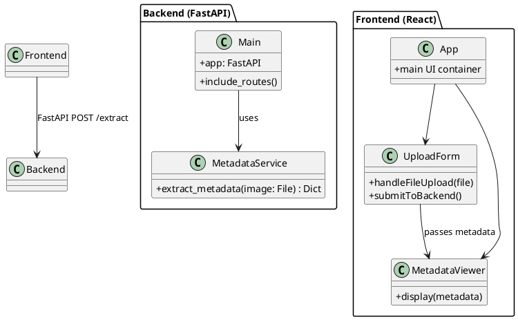

# WSUFotography

A privacy-focused photo-sharing web platform developed during CougHacks 2025. This project enables photographers to upload their photos while preserving or analyzing metadata securely.

## Team Fotography

- **Toufic Majdalani** – *Project Leader & Backend Software Engineer*
- **Donovan Burger** – *Backend Software Engineer*
- **Yakup Athanov** – *Frontend Software Engineer & Web Designer*
- **Denny Huang** – *Frontend Software Engineer*

##  Project Structure

```
WSUFotography/
 backend/           # FastAPI backend
    app/
       main.py               # FastAPI app entry point
       metadata_service.py  # Metadata extraction logic
    requirements.txt

 frontend/          # React + TypeScript frontend
     public/
     src/
     package.json
     tsconfig.json
```

##  Tech Stack

- **Frontend:** React, TypeScript, Tailwind CSS
- **Backend:** FastAPI (Python), Pillow (PIL)
- **Communication:** FastAPI POST endpoints
- **Extras:** EXIF metadata extraction

##  Features

- Upload images from UI
- Extract and display EXIF metadata (camera, lens, date, GPS, etc.)
- Minimalist UI for privacy-first photo sharing
- Modular, component-based frontend architecture

##  Getting Started

### Backend

```bash
cd backend
python -m venv venv
source venv/bin/activate  # On Windows: venv\Scripts\activate
pip install -r requirements.txt
uvicorn app.main:app --reload
```

### Frontend

```bash
cd frontend
npm install
npm run dev
```

##  UML Class Diagram


